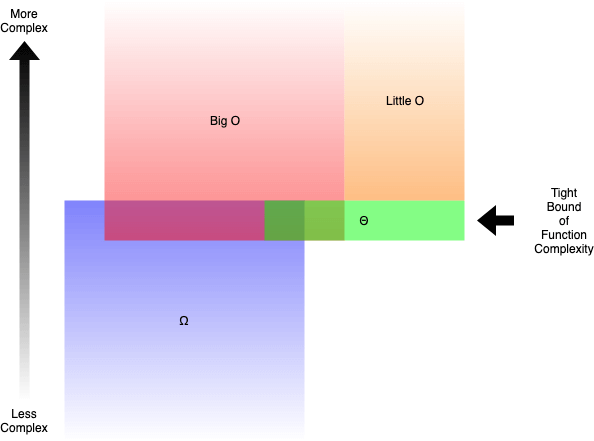
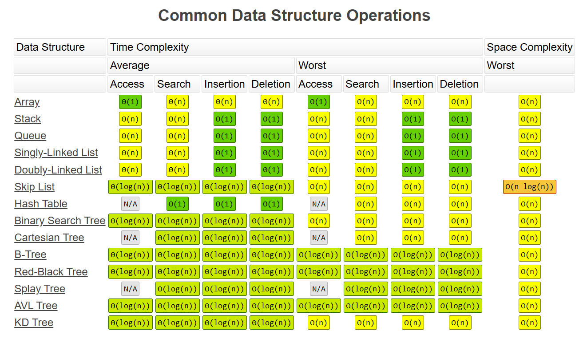
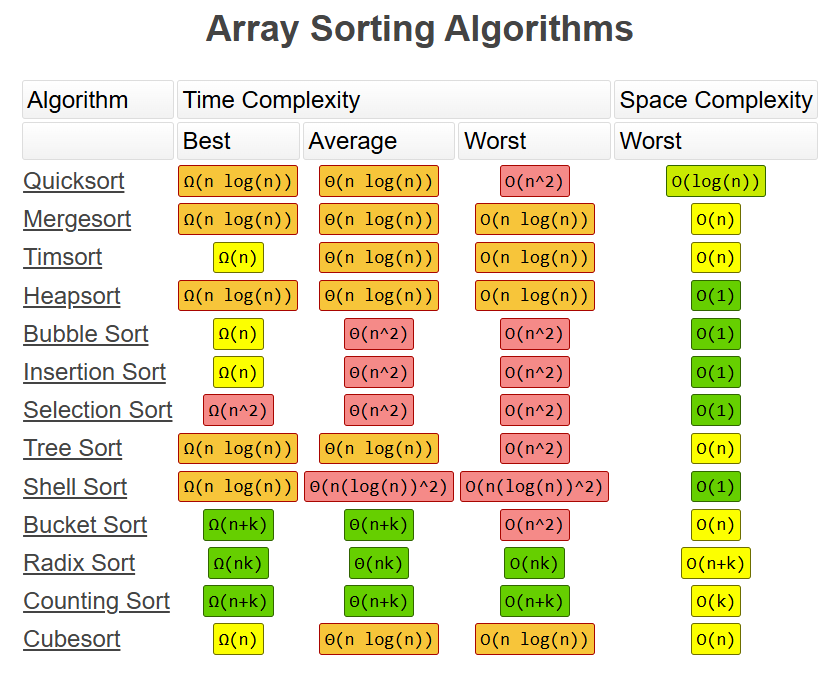

# Grokking Algorithms Golang

This repository are my implementation about all algorithms in book [Grokking Algorithms](https://www.manning.com/bhargava). And all the exercises solved.

## Illustrates the different complexity notations

**Simplifying:**

- Big O (O()) describes the upper limit of complexity. 
- Omega (Ω()) describes the lower limit of complexity.
- Theta (Θ()) describes the exact limit of complexity.
- Little O (o()) describes the upper limit excluding the exact limit.

## big O complexity Chart

## Commom Data Structure Operations

## Array Sorting Algorithms
